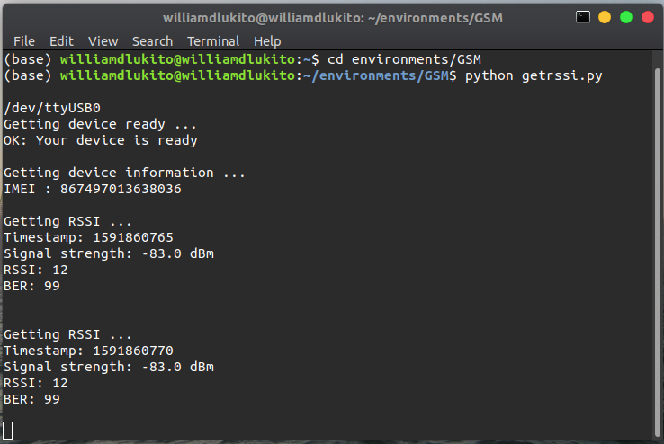
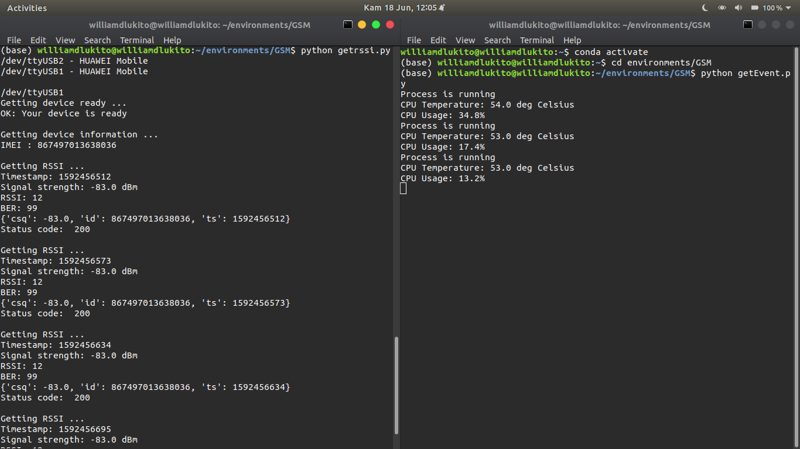

## README
This project is a experimental and developable. I will update every day.

### Objectives :
- Able to get RSSI data from GSM/GSPS UT,
- Able to POST that data to HTTP,

### Features :
- Using IMEI as Unique ID,
- Timestamp every data capture,
- Signal strength in dBm,
- IMEI (integer), signal strength (float), epoch/timestamp (integer)

### Preview
***(Updated 11-Jun-2020)***

***(Updated 12-Jun-2020)***

HTTP Post using Requests Library has been tried using Pastebin API. Disadvantage of using this API is pastebin always generate a new single link every loop.
Here is one of the link : https://pastebin.com/dELbha21

***(Updated 18-Jun-2020)***

- Enabling Auto-port-detection on getRSSIdata
- Event capturing. (CPU overload, CPU overheat, Process isn't running, etc)
- HTTP Post OK (Response Code 200)

